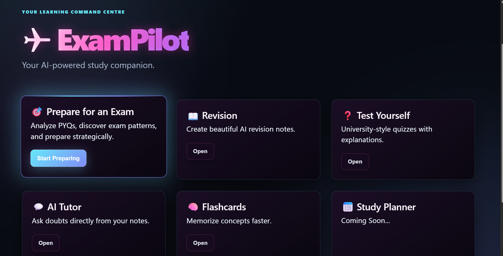
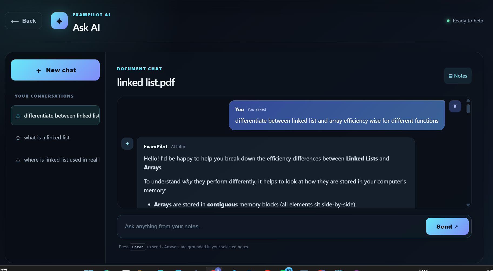
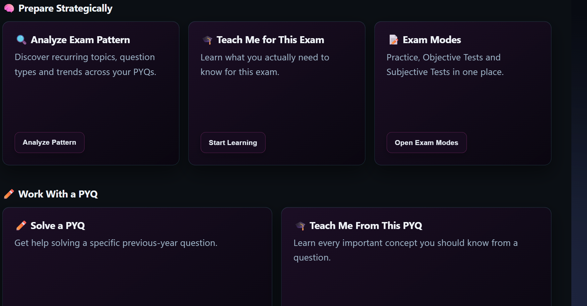
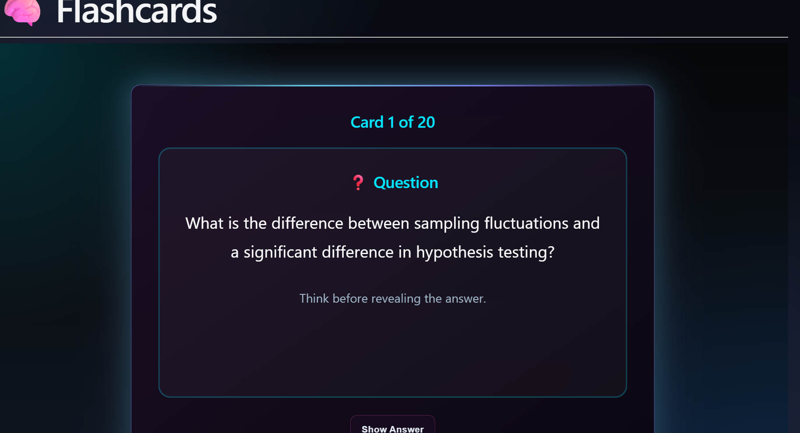

ExamPilot 🚀

AI-Powered Exam Preparation Platform

ExamPilot is a full-stack educational platform that helps students transform study materials and previous-year question papers into personalized exam preparation resources using AI.

Built with React + Vite, FastAPI, Gemini AI, and RAG-based document processing.

✨ Features
📚 AI Revision Notes

Generate multiple types of notes from uploaded study materials:

Short Revision Notes
Detailed Notes
Exam-Focused Notes
Concept Summaries
🎯 Smart Quiz Generation

Generate AI-powered quizzes from uploaded content.

Multiple Choice Questions
Topic-Based Assessment
Instant Feedback
Performance Analysis
🧠 Flashcards

Create flashcards automatically from study material for quick revision and active recall.

🗺️ Personalized Learning Roadmaps

Generate structured study plans including:

High Priority Topics
Frequently Asked Concepts
Important Formulas
Common Mistakes
Predicted Questions
Revision Sheets
Study Recommendations
📊 PYQ Analysis

Upload Previous Year Question Papers and analyze:

Frequently Asked Topics
Exam Trends
Important Areas
Question Patterns
📝 Exam Workspace

A dedicated preparation environment containing:

Practice Mode
Objective Mock Tests
Subjective Mock Tests
Pattern Analysis
Learning Roadmaps
🤖 AI Study Assistant

Interactive AI chatbot for:

Concept Clarification
Doubt Solving
Learning Assistance
🏗️ Tech Stack
Frontend
React
Vite
JavaScript
CSS
Backend
FastAPI
Python
AI & Processing
Gemini AI
RAG (Retrieval-Augmented Generation)
PDF Text Extraction
Database
SQLite
🔄 Workflow
Upload Study Material / PYQ
            ↓
Document Processing
            ↓
RAG Pipeline
            ↓
AI Analysis
            ↓
Notes / Quizzes / Flashcards
            ↓
Roadmaps / Mock Tests
            ↓
Performance Insights
📸 Core Modules
AI Revision Notes
Smart Quiz Generation
Flashcards
PYQ Analysis
Learning Roadmaps
Objective Mock Tests
Subjective Mock Tests
Sample Question Papers
AI Chatbot
Exam Workspace
🚀 Future Enhancements

Planned features:

Solve PYQ
Teach Me From This PYQ
Study Planner
Focus Mode
Study Any Topic

ExamPilot aims to provide students with a personalized AI-powered study environment that combines study materials, PYQs, assessments, and learning guidance into a single platform.

